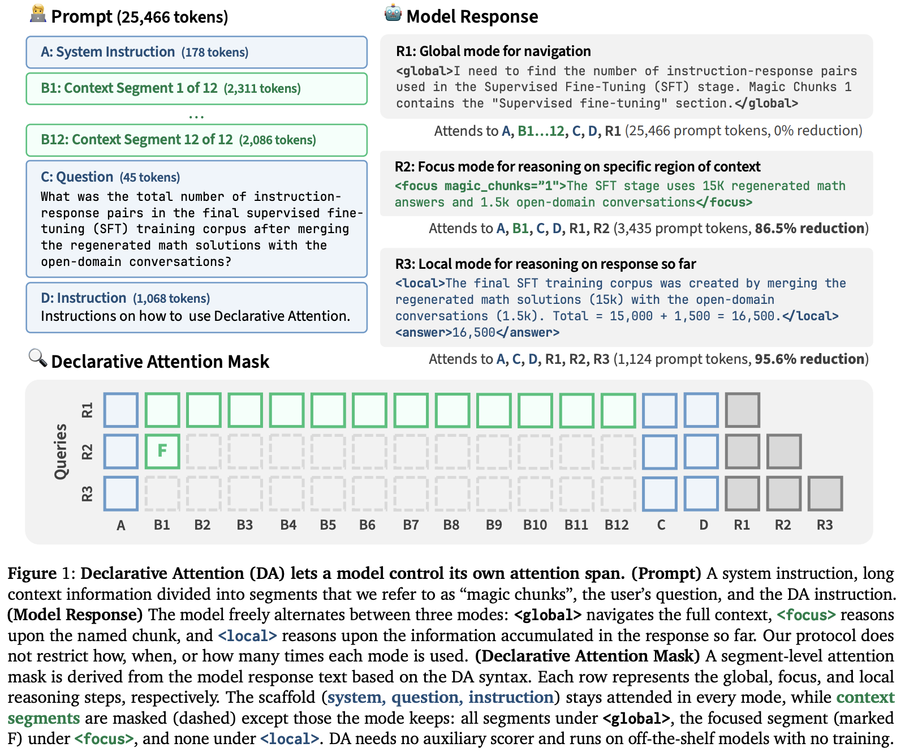

</img>

## Declarative Attention - (wip)

Implementation of the procedure in [Language Models Can Control Their Own Attention](https://arxiv.org/abs/2609.02737), from Namgyu Ho et al. of KAIST AI

## Install

```bash
$ pip install declarative-attention
```

## Usage

```python
import torch
from declarative_attention import DeclarativeStateMachine

# Define context chunk spans (1-indexed)
chunk_spans = [
    (16, 1024),   # Chunk 1
    (1024, 2048), # Chunk 2
    (2048, 3072), # Chunk 3
]

state_machine = DeclarativeStateMachine(
    chunk_spans = chunk_spans,
    tokenizer_decode = tokenizer.decode  # or lambda t: tokenizer.decode([t])
)

# Decode loop: feed generated tokens (int, torch.long scalar, or str)
state_machine.step('<focus chunks="1,2">')

assert state_machine.is_focus
assert state_machine.active_chunks == {1, 2}

# Obtain 1D boolean attention mask for current decode step
mask = state_machine.get_mask(total_len = 4096)  # True for kept keys, False for masked out

# Model finishes chunk reasoning and reverts back to global
state_machine.step('</focus>')
assert state_machine.is_global
```

### Custom Attention Patterns

Researchers can easily declare custom attention patterns and tags.

#### 1. Logarithmically Spaced Attention (Recent to Past)

Sample chunks with exponentially decaying density into the past (e.g. current, $t-1, t-2, t-4, t-8\dots$):

```python
state_machine = DeclarativeStateMachine(chunk_spans)

@state_machine.on('log_sparse')
def handle_log_sparse(machine, base = 2):
    base = int(base)
    total = len(machine.chunk_spans)

    # Powers of base distance from current chunk: 0, 1, 2, 4, 8...
    offsets = [0] + [base ** i for i in range(10)]
    machine.active_chunks = {
        total - d for d in offsets if (total - d) in machine.chunk_spans
    }

# When model emits <log_sparse> or <log_sparse base="3">
state_machine.step('<log_sparse base="2">')

# Reverts back to global when closed
state_machine.step('</log_sparse>')
```

#### 2. Sliding Window (Last $K$ Chunks)

Select the most recent $K$ context chunks via a custom `State`:

```python
from statemachine import State
from declarative_attention import DeclarativeStateMachine

class CustomAttentionMachine(DeclarativeStateMachine):
    window_mode = State()

    window = window_mode.from_(DeclarativeStateMachine.global_mode)
    revert = DeclarativeStateMachine.global_mode.from_(
        DeclarativeStateMachine.focus_mode,
        DeclarativeStateMachine.local_mode,
        window_mode
    )

    @window.on
    def on_window(self, size = 2):
        total = len(self.chunk_spans)
        self.active_chunks = {total - i for i in range(int(size)) if total - i > 0}

state_machine = CustomAttentionMachine(chunk_spans)

# Model calls <window size="2">
state_machine.step('<window size="2">')
assert state_machine.is_window_mode
```

#### 3. Dynamic Temperature & In-Context Verification

Models can dynamically adjust sampling temperature during decode—brainstorming at high temperature, then re-attending to those thoughts at zero temperature for critical verification:

```python
state_machine = DeclarativeStateMachine(chunk_spans)
state_machine.temperature = 0.7  # default

@state_machine.on('explore')
def on_explore(machine, temp = 1.2):
    machine.temperature = float(temp)

@state_machine.on('verify')
def on_verify(machine, temp = 0.0):
    machine.temperature = float(temp)

# High-temperature exploration
state_machine.step('<explore temp="1.2">')

# Switch to zero-temperature verification on Chunk 1
state_machine.step('</explore><focus chunks="1"><verify temp="0.0">')
```

## Citations

```bibtex
@misc{ho2026languagemodelscontrolattention,
    title    = {Language Models Can Control Their Own Attention}, 
    author   = {Namgyu Ho and Huzama Ahmad and Woosung Koh and Se-Young Yun and Tal Schuster and Cicero Nogueira dos Santos},
    year     = {2026},
    eprint   = {2609.02737},
    archivePrefix = {arXiv},
    primaryClass = {cs.CL},
    url      = {https://arxiv.org/abs/2609.02737}, 
}
```
